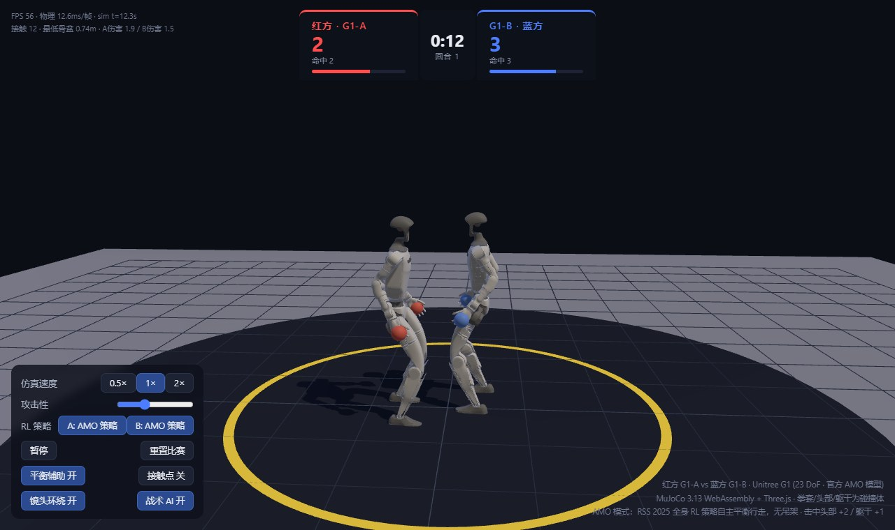

# G1 机器人拳击 · MuJoCo WASM + AMO 强化学习策略

在浏览器里让 **两台 Unitree G1（23 自由度，官方 AMO 模型）** 互相拳击的实时物理仿真；
另有 29 自由度追踪场景与双机真实对打模式（URL 参数见"运行"一节）。
物理引擎是 Google DeepMind 官方的 **MuJoCo WebAssembly 构建**（`@mujoco/mujoco` 3.13.0），
渲染用 Three.js，全部计算都在浏览器本地完成，无需任何服务端。

> **项目总计划与进度总览见 [`docs/ROADMAP.md`](docs/ROADMAP.md)**。
> 动作策略训练与导入流程见下文["动作策略训练与导入"](#动作策略训练与导入)一节
> （训练链在本项目 `.workbuddy/gpu/g1dance_pipeline/`，fight 自博弈 v3 方案
> [`docs/plan-fight-selfplay-v3.md`](docs/plan-fight-selfplay-v3.md)）；
> [`docs/plan-mjlab-gpu-training.md`](docs/plan-mjlab-gpu-training.md) 所述
> GPU 训练执行手册对应的本机训练链已停用（历史文档）。



## 运行

```bash
node server.mjs 8080   # 端口参数可选，默认 8080；被占用时换一个，如 node server.mjs 8090
# 打开 http://localhost:8080/
```

`/` 会 302 到 `/index.html?v=3`（规避浏览器对旧页面的长期缓存），静态文件均 `no-cache`。

### 模式切换与 URL 参数

四种玩法模式**推荐直接在页面左下面板的"模式中心"切换**（四张模式卡，当前模式
高亮，点击即切换并重新加载页面），无需手写 URL；URL 参数与卡片一一对应：

| URL | 模式卡 | 场景 |
|---|---|---|
| 无参数 | AMO 自由模式 | 默认 AMO 场景：23-DoF，两台机器人 AMO 策略拳击 |
| `?scene=tracking` | 守卫练习 | 29-DoF 追踪场景（探测 `vendor/policy/boxing_guard_meta.json`，缺失自动回退 AMO） |
| `?scene=tracking&combo=1` | 组合拳表演 | 双机组合拳常驻循环；子选项 `&faceoff=1` 让 B 机 180° 面向 A |
| `?scene=tracking&fight=1` | **真实对打**（推荐） | **双机真实对打**（见下一节） |

- `fight=1` 必须与 `scene=tracking` 同给才生效，且优先于 `combo`
- 调试参数 `&policy=<名字>.bin`：改加载 `vendor/policy/` 下的其他 fight 权重
  （如 `&policy=boxing_fight_dev.bin`）；名字只允许字母数字与 `._-`，非法名或
  权重缺失时自动回退默认行为

推荐使用 Chrome / Edge。首次加载需要下载约 21MB 的 WASM 引擎、51 个 STL 网格，
启用 AMO 模式时还会再下载 18MB 策略权重。

## 双机对打（fight 模式）

`?scene=tracking&fight=1` 开启：两台 G1 共享同一 168 维观测（含对手状态 14 维）的
fight 策略自主对打，KO / 回合重置 / 记分全部启用，无需面板干预。

**互面航向伺服**（2026-10-01 合入）：机器人持续转向面向对手的闭环，fight 模式默认开启。

- 浏览器端恒为开启（浏览器环境没有进程环境变量）
- 无头 / node 环境 `FIGHT_HEADING_SERVO=0` 关闭（基线对比用）
- `FIGHT_HEADING_TAU` 平滑时间常数（秒），夹紧 [0.05, 2.0]，默认 0.3

### 无头量化命令与门槛

```bash
node tools/test_tracking_boxing.mjs 60 --fight --seed 1
```

输出互面误差（facing mean / median / p90、>90° 占比）、交战率、命中数、KO 与双机
站立占比。质量门槛：median ≤ 35°、>90° ≤ 15%、命中 ≥ 3、双机站立 ≥ 60%
（第 4 轮 P0-2 决胜轮实测，2026-10-02，60s --seed 1：median 21.4° / >90°
4.3% / 命中 29 / 双机站立 89.4%，抱架保持率 A 88.9% / B 94.4%）。

**形态指标与门槛（2026-10-02 形态修复）**：同一命令增补输出——

- **贴身占比**：躯干水平间距 <0.35m 的时间占比，门槛 ≤15%（反"贴脸缠抱"）。
- **抱架保持率**：非出拳状态下（任一臂拳速 EMA >1.2 m/s 即算出拳，整步
  不计入分母；与运行时守卫混合出拳判定同一常量。2026-10-02 第 2 轮口径修订：
  0.6 阈值被参考跟踪的常规摆臂过触发——"出拳中"占比 ~50% 而 60s 仅 9 次命中，
  提到 1.2 m/s 后真出拳（2-4 m/s）仍可干净分离）双拳均"高于肘部 +0.03m
  且接近头高（|拳套 z − 头 site z| ≤0.25m）"的时间占比，门槛 ≥70% 且
  A/B 两侧各自 ≥70%（反"双臂垂下/抱架丢失"）。
- 步法观察项（不设硬门）：骨盆水平路径长度/时长、躯干间距 min/mean/max。

对应运行时修复（`src/boxing_ai.mjs` "FIGHT 视觉形态修复"小节，浏览器与
headless 共用同一实现）：非出拳手臂 PD 目标向高抱架关节目标混合（拳套 FK 至
torso 系 (0.195, 0.070, 0.399)，近头高/高于肘；第 2 轮 P0-2 修订：守卫混合
改为两级结构——policyTick 覆写边界按跨窗口持久的混合水平一次性重混，稳态
水平 = `FIGHT_GUARD_MIX_MAX`（第 3 轮起 0.8），窗口内继续指数微调，破"每窗
口从头爬坡"瓶颈；第 4 轮 P0-2 修订：守卫肘目标 -0.35→-0.6 加深，并对守卫
混合覆盖的 8 个臂关节加重力前馈（τ = k × 混合水平随比例缩放，出拳瞬间为零，
见 `FIGHT_GUARD_FEEDFORWARD`））、躯干间距
<0.42m 时施加限幅 80N 的裁判分离力、>1.25m 时施加限幅 28N 的距离保持力
（用量在 `fight-shaping forces` 行透明报告；前馈用量另计入
`fightForceUsage.ff`，供复验核查）。

覆盖边界说明（2026-10-02 审查 P1-1）：fight 模式决策层短路、不消费注入 RNG，
`--seed 1/2` 的输出逐字节相同（seed 参数在 fight 下仅形式留存）；验收场景
（出生间距 1.2m）双机躯干水平间距实测 0.62-1.23m，不进入分离力（<0.42m）与
接近力（>1.25m）的触发区间——该场景 `fight-shaping forces` 两项为 0 N·s 属
预期，两项力的生效性由浏览器长时间对局观察覆盖，无头回归不测量。

```bash
# 关闭伺服的基线跑（仅关航向闭环；守卫混合/分离/接近力在伺服关闭时仍生效）。
# 该跑用于对比航向伺服的净贡献。第 4 轮 P0-2 复测（60s --seed 1）：median
# 83.4°（A 59.6° / B 110.3°，>90° 46.1%）——守卫前馈加固后伺服关闭基线已
# 劣于伺服合入前的原始缺陷 ≈61°（高抱架改变了无航向闭环时的转向动力学，
# 第 3 轮状态复测 median 71.9°，漂移主因在第 3/4 轮守卫加固，归因参考），
# 航向伺服净贡献 83.4°→21.4° 依旧显著。该跑无质量门槛（缺陷诊断用）
node tools/test_tracking_boxing.mjs 60 --fight --no-heading-servo --seed 1
# 伺服调参示例
FIGHT_HEADING_TAU=0.2 node tools/test_tracking_boxing.mjs 60 --fight --seed 1
```

### v3 自博弈训练轮记录（2026-10-03，门槛未过 → v2 保持部署）

fight 策略 v3 自博弈（方案 [`docs/plan-fight-selfplay-v3.md`](plan-fight-selfplay-v3.md)，
训练链 `.workbuddy/gpu/g1dance_pipeline/`，任务 `Unitree-G1-Sparring-P3`）已完成
A1/A2/B2 三轮训练与部署评估：d3 停机扫描择优、训练侧均达标，但
**浏览器门槛三轮均未过，B2 后正式 `vendor/policy/boxing_fight.*` 仍为 v2**。

- 来源 run：`.workbuddy/gpu/g1dance_pipeline/third_party/unitree_rl_mjlab/logs/rsl_rl/g1_sparring/2026-10-03_02-50-47`
- best ckpt：`model_2000.pt`，d3 复合分 seed0 0.9624 / seed7 0.9627（v2 基线
  同口径 0.8168 / 0.7926，+17.8%）；`verdict.json` 与 `best.pt` 在 run 目录
- 部署链：`pipeline/export_ckpt_onnx.py`（P3 任务，168 维，run 目录的
  `<run名>.onnx` 是末次保存的自动导出，历史 ckpt 须单独补导）→
  `tools/extract_tracking_onnx.py` → `check_fight_meta.mjs` 14 项 PASS →
  `test_tracking.mjs` JS↔ONNX 对齐 1.4e-6 PASS → 浏览器双 seed 回归

浏览器 60s `--fight` 门槛实测（fight 模式决策层短路 RNG，`--seed 1/7` 输出同值；
v2 仅 seed 1 有参考，v2 贴身值为 2026-10-03 回滚后复测）：

| 指标 | v3 门槛 | v2 实测（seed 1） | v3 model_2000 实测（seed 1/7） | 判定 |
|---|---|---|---|---|
| 命中 | ≥40 | 29 | **2** | FAIL（主指标） |
| 双机站立 | ≥90% | 89.4% | 100.0% | 过 |
| 抱架保持 A/B | 各 ≥85% 且均值 ≥90% | 88.9% / 94.4% | 97.9% / 98.4% | 过 |
| 航向 median | ≤25° | 21.4° | 15.3° | 过 |
| >90° 占比 | ≤8% | 4.3% | 0.0% | 过 |
| 贴身占比 | ≤12% | 0.0% | 0.0% | 过 |

归因：v3 形态奖励在浏览器环境过度抑制出拳——训练侧命中和 1.05 次/s/env，
浏览器 60s 仅 2 次命中（格挡 41 次、抱架保持 97.9%、交战率 91.4%）；候选 meta
与 v2 逐字段一致（kp/kd、default_joint_pos、action_scale、motion 表全同），
排除部署链问题，差异确系策略权重。已按方案 §4.5 回滚：正式三件套 md5 与 v2
原件一致，回滚后 `60 --fight --seed 1` 复测 PASS（命中 29，与 v2 参考值吻合）。
候选三件套保留在 `vendor/policy/boxing_fight_v3cand.*`，v2 备份在
`vendor/policy/boxing_fight_v2.bak/`，供下一轮（形态权重调低重训，方案 §7
止损路径）复用。

**V3-B2 轮（2026-10-03，命中口径修复 + 形态权重减半重训，门槛未过 → v2
保持）**：针对 A1/A2 部署失败根因，把训练侧命中口径改为与浏览器同口径
（`fight_contact`/`fight_contact_rev` 拳 vs 头/躯干 body 精确匹配，排除对方
手臂）后重训 3000 iters。

- 来源 run：`.workbuddy/gpu/g1dance_pipeline/third_party/unitree_rl_mjlab/logs/rsl_rl/g1_sparring/2026-10-03_16-30-36`
- best ckpt：`model_2500.pt`，d3 复合分 0.8885（v2 同口径基线 0.6605，
  +34.5%）；新口径下头/躯干接触率 0.307 次/s/env = v2 的 16 倍；
  `verdict.json` 与 `best.pt` 在 run 目录

浏览器 60s `--fight` 复测：口径修复确认起效——命中全部为真实头/躯干打击，
grazes 出现 10 次、与格挡正常分流；除主指标外其余全面优于 v2：

| 指标 | v3 门槛 | v2 实测（seed 1） | B2 model_2500 实测 | 判定 |
|---|---|---|---|---|
| 命中 | ≥40 | 29 | **14**（A1/A2 曾为 2/3） | FAIL（主指标） |
| 双机站立 | ≥90% | 89.4% | 100.0% | 过 |
| 抱架保持 A/B | 各 ≥85% 且均值 ≥90% | 88.9% / 94.4% | 97.0% / 98.5% | 过 |
| 航向 median | ≤25° | 21.4° | 15.9° | 过 |
| >90° 占比 | ≤8% | 4.3% | 0.0% | 过 |

判定：策略强度仍不及 v2，主指标未达门槛，**未替换**，正式权重保持 v2
（回滚已 md5 验证）。候选三件套保留：`boxing_fight_v3cand`（A1）、
`v3a2cand`（A2）、`v3b2cand`（B2）。后续可选（未承诺）：从 B2
model_2500 续训 +3000 iters（命中曲线尚在爬升），或上调 hit/engage 权重
再训；另 fight 模式决策层短路 RNG、双 seed 协议在 fight 下退化为单轨
（harness 种子不影响 fight 轨迹），如需真双 seed 验收需先给 harness 加
出生抖动 RNG 注入点。

训练侧（fight 策略训练与权重产物）见下文
["动作策略训练与导入"](#动作策略训练与导入)一节与
[`docs/plan-fight-selfplay-v3.md`](docs/plan-fight-selfplay-v3.md)
（历史交接：[`docs/HANDOFF-FIGHT-20260929.md`](docs/HANDOFF-FIGHT-20260929.md)）。

## AMO 强化学习模式（核心）

- 策略：**AMO (Adaptive Motion Optimization)**，RSS 2025，UT Austin
  （[OpenTeleVision/AMO](https://github.com/OpenTeleVision/AMO)，Apache-2.0），
  全身 RL 控制器，输出 15 个腿部+腰部关节动作，手臂通过输入适配器以 8 关节目标跟踪
- **默认开启 RL**：打开页面后两台机器人即挂载 AMO 策略（权重 18MB 在加载页与
  引擎/网格并行下载，不增加额外等待）；面板 **机器人策略 A / B** 按钮
  （悬浮有说明）可把任一台切回脚本模式或重新开启：
  - **AMO 模式**（默认）：策略以 50Hz 推理（纯 JS 重实现，与 torch 参考误差 ~1.5e-7），
    500Hz PD 扭矩输出，机器人**自主平衡、行走、摆臂**——没有任何吊架辅助，
    被击中时靠策略抗扰，KO 时移除策略让机器人自然瘫倒
  - **脚本模式**：姿态库状态机 + 可关闭的骨盆"吊架"辅助（旧的展示模式）
- 拳击 AI 在两种模式下共用：试探步、接近/后撤、刺拳/交叉拳/勾拳/连击、
  腰部转体出拳、命中后踉跄
- **战术 AI（自博弈训练）**：`src/tactics.mjs` 是一个 13 观测 → 10 动作的
  纯 JS 小策略网络，在无头 MuJoCo 里通过 REINFORCE 自博弈训练
  （`node tools/train_tactics.mjs`，详见下文），替代旧版
  "距离阈值 + 加权随机挑招式"。`vendor/tactics/tactics.json` 存在时浏览器
  自动加载并在面板提供开关；文件不存在时回退旧逻辑，完全可选

## 玩法与界面

- **击中头部 +2 分 / 击中躯干 +1 分**，双拳相碰判为格挡
- 伤害值累积（头部 1.5 / 躯干 1.0，随时间恢复）到阈值即 **KO 倒地**，2 秒后自动开下一回合
- 比分、回合与 KO **全自动进行**，打开页面即可观看，无需任何操作
- **首次访问引导**：第一次打开会弹出欢迎浮层（当前模式说明 + 上手要点），
  点"开始观看"关闭并记住；面板右上"？"可随时重看
- **模式中心**（面板顶部）：真实对打 / 组合拳表演 / 守卫练习 / AMO 自由模式
  四张卡，当前模式金色高亮，点击切换（重新加载页面）；"更多模式"按钮滚动到该区
- **机器人策略 A / B**：每台机器人独立三态（追踪片段/fight 策略 · AMO 策略 ·
  脚本模式），点击切换；可一台打策略一台当脚本木桩陪练
- 主区控件：仿真速度（0.25×/0.5×/1×/2×）、攻击性、暂停、重置比赛、镜头环绕、
  一键录制视频（见下节）
- **调试 / 进阶**（默认收起的分组）：平衡辅助（仅脚本模式有效）、接触点可视化、
  评估视角、拳套轨迹
- 所有按钮均有中文悬浮说明（鼠标停留即可查看含义）
- 鼠标拖拽旋转视角，滚轮缩放

## 视频录制

面板主区「● 录制视频」按钮一键录制当前画面：点击开始（按钮变红脉动、只显示
一个红点，**不显示任何录制状态文字**，说明在按钮悬浮 title 里），再次点击停止，
自动下载 `g1-boxing-YYYYMMDD-HHMMSS.<ext>`，横幅报告文件名、大小（MB）与时长。

- **合成范围（所见即所得）**：采用离屏合成捕获——渲染循环每帧把 3D 画面
  （three.js 画布）与轻量 HUD 合成到一张离屏 canvas 再编码。进入视频的有：
  3D 对局画面、比分/命中数、时间/回合（含血条）、KO 与回合横幅大字、命中浮字
  （"格挡！""+2 击中头部！"等）。受击时屏幕边缘的红蓝闪光**不**进入视频。
- **格式**：按浏览器能力自动选择容器与编码档位——MP4 直录优先选 H.264
  **High 档**（`avc1.640028`，同码率画质最好），探测不支持时自动回退 Baseline
  档；MP4 直录需要 **Chrome 126+**（同代 Edge 亦可），不满足时按
  `webm/h264 → webm/vp9 → webm` 逐级回退并保存 `.webm`，保存后横幅提示"当前
  浏览器不支持 MP4 直录，已保存 WebM"（WebM 可被主流播放器与剪辑软件直接
  打开）。码率按画面高度自适应：≥1440p 24Mbps / ≥1080p 16Mbps / ≥720p 10Mbps /
  其余 6Mbps。录制分辨率跟随浏览器窗口大小 × 设备像素比（渲染上限 2x），
  最大化窗口可提高录制分辨率。
- **已知限制**：录制期间**切换模式或刷新页面会中断录制**（模式切换本就是整页
  跳转）；标签页切到后台后 rAF 节流会冻结录制画面；录制中暂停仿真时视频画面
  同步冻结（预期行为）。
- **自动化验收**：控制台句柄 `window.__rec`（`start` / `stop` / `state()` /
  `mime` / `lastBlob`），可无 DOM 驱动录制并检查产物 `Blob` 的大小与类型。

## 实现要点

```
src/rl_policy.mjs    AMO 策略运行时（纯 JS，浏览器/无头共用）
                     · student 网络 2474→1024→1024→512→15（ELU）
                     · 输入适配器 12→15（BatchNorm+LeakyReLU，手臂条件输入）
                     · 10 帧本体感知历史（Conv1d 编码）+ 25 帧额外历史
                     · 50Hz 策略 tick / 500Hz PD 扭矩（decimation 10）
src/tracking_policy.mjs  阶段4 追踪策略运行时（纯 JS，BeyondMimic/mjlab 导出）
                     · TrackingNetwork：154→512→256→128→29（ELU）+ 动作表 Gather
                     · TrackingFighter：50Hz 观测 / 200Hz PD，与 ONNX ~1e-6 对齐
                     · B 侧 yawOffset：参考姿态旋转 π（策略体坐标系不变性）
src/boxing_ai.mjs    拳击控制器（无头调参与浏览器共用）
                     · AMO 指令接口：vx/vy/朝向/躯干 + 8 臂关节目标
                     · 战术决策：tactics.json 策略优先，缺省回退
                       距离阈值 + 加权随机（行为与旧版一致）
                     · 追踪模式：战术决策只排队片段，切换发生在守卫边界
                     · 脚本回退模式：姿态库 + 吊架辅助
                     · 命中判定：真实接触对（拳套 × 头/躯干）+ 冷却 + 击退冲量
                     · 伤害值 KO（AMO 下即断扭矩软瘫倒地）/ 回合重置
src/tactics.mjs      战术策略网络（纯 JS MLP + REINFORCE 更新 + Adam）
src/main.js          浏览器主程序：WASM 初始化、VFS 喂入 STL、
                     mjv_updateScene 抽象场景 → Three.js 网格、HUD/计分/特效
tools/extract_tracking_onnx.py  追踪 ONNX → bin/meta/测试向量（两种导出变体）
tools/test_tracking.mjs     追踪策略 JS↔ONNX 对齐
tools/test_tracking_sim.mjs 追踪策略单机 sim2sim（WASM）
tools/test_tracking_boxing.mjs  追踪模式双机无头回归
tools/check_fight_meta.mjs  fight obs 布局契约检查
vendor/policy/       amo.bin（18MB）+ spinkick.bin（管线保险）+ boxing_*（阶段4片段）
vendor/mujoco/       @mujoco/mujoco 3.13.0（Apache-2.0）
vendor/three/        three.js r170（MIT）
models/unitree_g1/   官方 G1 网格 assets（AMO 与追踪模型共用）
models/tracking_g1/  mjlab G1 29-DoF 基模型（阶段4）
```

### 追踪模式（阶段 4，`?scene=tracking` 或面板模式中心"守卫练习"卡）

`vendor/policy/boxing_{guard,jab,cross,hook}.*` 齐备时自动启用：
29-DoF G1 由动作片段策略驱动（战术决策排队片段，在守卫段首尾切换）。
当前为 v0 预览（guard 策略四槽位，训练收敛后按
"动作策略训练与导入"一节替换）。详见 `docs/stage4-tracking-notes.md`。

> **图例（2026-09-29）**：默认模式当前为 **guard-only**（守卫循环），完整拳法
> 组合循环见 `?scene=tracking&combo=1`（双机 12.5s 组合拳常驻循环）。
> 追加 `&faceoff=1` 开启面对面对抗子选项（B 机 180° 转身面向 A 机）。

### 场景模型的坑（务必知道）

- AMO 策略训练于 **AMO 仓库的官方 g1.xml**（23 扭矩电机、腕部融合）。
  mujoco_menagerie 的模型（29 位置执行器）与策略不兼容，站立都会倒
- 官方 xml 所有 mesh geom 均为纯视觉（contype=0），**机器人只靠每只脚 4 个 5mm
  小球与地面接触**；拳套/头部球/躯干胶囊是本 demo 添加的碰撞体
  （躯干胶囊 density=0 不改变动力学）
- 官方 `<default>` 给所有铰链关节 `damping=2 frictionloss=0.2`——生成场景时
  丢失这两项会让策略"能站不能走"
- 头部碰撞球若放在官方头网格锚点（z=-0.044）会与腰部链接碾磨，行走必摔；
  必须放在真实头部中心（torso 系 z≈+0.406，质量 1.036kg 与官方 head_link 一致）

### 关键的 WASM 绑定注意点（踩坑记录）

- `data.qpos` / `data.ctrl` / `model.mesh_vert` 等是 **WASM 堆的实时视图**（Float64Array/Float32Array），直接读写即可
- **自由关节 qpos 布局 `[x,y,z, qw,qx,qy,qz]`——四元数从 qposadr+3 开始**；
  `qvel` 的角速度部分是**体坐标系**
- `data.contact` 每次访问会在堆上**分配一份副本**，用完必须 `delete()`，否则内存泄漏直至 `memory access out of bounds`
- `mjvScene.geoms`、`mjv_geoms.get(i)` 返回的包装对象同理需要 `delete()`
- timestep 在 `model.opt.timestep`（顶层没有 `model.timestep`）
- 从字符串加载带网格的模型：`MjModel.from_xml_string(xml, vfs)` + `vfs.addBuffer('unitree_g1/assets/x.STL', bytes)`（键要与 xml 的 meshdir 对上）
- **`mjvGeom.dataid` 在本 WASM 构建里是坏的**：对 mesh geom 返回的是真实 mesh id 的 **2 倍**，
  直接拿来取网格会导致机器人"散架"（每个零件装错 STL）。正确做法是用 `mjvGeom.objid`
  （geom id）反查 `model.geom_dataid[objid]` 拿真实 mesh id，见 `src/main.js` 的 WORKAROUND 注释

## 回归测试

```bash
python .workbuddy/tmp/test_scene_dual.py   # python 侧 10s 双机器人回归
# 阶段 4 追踪模式：
node tools/test_tracking.mjs vendor/policy/boxing_guard   # JS↔ONNX 对齐
node tools/test_tracking_sim.mjs boxing_guard             # 单机 sim2sim
node tools/test_tracking_boxing.mjs                       # 追踪双机 16s 回归（含 KO 注入）→ 已知 FAIL（见下）
BOXING_COMBO=1 node tools/test_tracking_boxing.mjs        # combo 42s 回归 → PASS
node tools/test_tracking_boxing.mjs 22 boxing             # 追踪双机回归（22s，boxing 片段）
node tools/test_tracking_boxing.mjs 60 --fight --seed 1   # 双机对打 60s 量化（门槛见"双机对打"节）→ PASS
node tools/check_fight_meta.mjs                           # fight obs 布局契约检查
```

**已知 FAIL**：`node tools/test_tracking_boxing.mjs`（默认 16s）在当前 HEAD
即失败——A 机 t≈1.4s 摔倒触发 minZ 门槛（0.39 < 0.40）。经审查确认是航向
伺服修复之前就存在的历史遗留，与 fight 模式无关。

## 动作策略训练与导入

本仓库为**纯推理**仓库：动作（跟踪）策略训练不在浏览器侧进行，训练链在本项目
`.workbuddy/gpu/g1dance_pipeline/`（BeyondMimic/mjlab 跟踪训练管线本机副本，
fight 自博弈 v3 方案见 [`docs/plan-fight-selfplay-v3.md`](docs/plan-fight-selfplay-v3.md)）。
历史文档提及的 `/home/xy/zcode/g1-dance` 仓库**不承担本项目训练**：片段库
（guard/jab 等）的跟踪策略沿用已部署权重，如需再训在本项目内按 v3 模式
（新任务注册名 + 新 cfg + 新训练入口）扩展。

训练产物 run 目录内的 `<run名>.onnx`（内嵌参考动作数组与元数据；注意该文件是
**最后一次保存时的自动导出**，历史 ckpt 需先用训练侧
`pipeline/export_ckpt_onnx.py <model_XXX.pt> <outdir> --task <任务名>` 补导）
用本仓库的 `tools/extract_tracking_onnx.py` 转换为 `vendor/policy/<slot>.bin` +
`<slot>_meta.json` + `<slot>_test_vectors.json` 三件套：

```bash
uv run --no-project --with onnx --with onnxruntime python \
    tools/extract_tracking_onnx.py <run目录>/<run名>.onnx vendor/policy/<slot>
```

**文件名必须匹配加载端硬编码槽位**：片段库 `boxing_{guard,jab,cross,hook,combo}`
（`src/main.js` 53-57 行 `TRACKING_CLIPS`），fight 策略 `boxing_fight`
（`src/main.js` 85-89 行）。

导入后依次回归：

```bash
node tools/test_tracking.mjs vendor/policy/<slot>   # JS↔ONNX 对齐（1e-6 相对门槛，绝对下限 1e-6）
node tools/test_tracking_sim.mjs <slot>             # 单机 sim2sim（WASM）
node tools/test_tracking_boxing.mjs 22 boxing       # 双机无头回归
```

## 战术 AI 自博弈训练

> 战术（决策）自博弈训练仍在仓库内进行（CPU、纯 node）；动作（跟踪）策略
> 训练在本项目 `.workbuddy/gpu/g1dance_pipeline/` 进行，见上一节与
> "双机对打"节的 v3 训练轮记录。

```bash
node tools/train_tactics.mjs --episodes 3000 --workers 6 --ep-len 24
node tools/eval_tactics.mjs 20 24   # 策略 vs 旧版加权随机的命中数对比
```

- 训练在脚本模式（无 AMO 权重）下进行：快且稳定，战术指令语义两种模式共用，
  学到的策略直接用于 AMO 模式
- REINFORCE + 移动平均 baseline + 熵正则（Adam），对手池取历史快照防止
  策略互相追尾；奖励 = 命中 +（头 3/躯干 1.5）、被击中 -2、格挡 +0.3、KO ±8
- 产物 `vendor/tactics/tactics.json`（约 15KB），浏览器加载后自动启用
- 调研报告（更进一步的方案：mjlab 动作跟踪 / RoboStriker 自博弈）见
  `docs/research-boxing-approaches.md`

## 版权

- MuJoCo：Apache-2.0（Google DeepMind）
- AMO 策略权重：Apache-2.0（OpenTeleVision/AMO, RSS 2025）
- Unitree G1 网格：Unitree 官方（经 AMO 仓库分发）
- three.js：MIT
